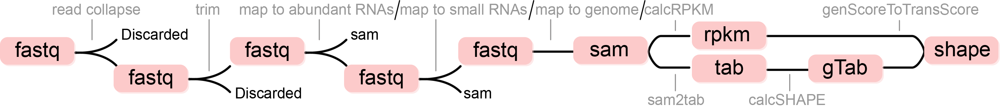

# icSHAPE-pipe

icSHAPE-pipe is a pipeline to calculate icSHAPE score in genome with sliding window strategy.

## Installation

### Prerequisites

<b>Python ≥ 2.7</b>

Python packages:

* <b>pysam</b>: https://pypi.org/project/pysam/
* <b>numpy</b>: http://www.numpy.org
* <b>pandas</b>: https://pypi.org/project/pandas/
* <b>matplotlib</b>: https://pypi.org/project/matplotlib/
* <b>seaborn</b>: https://seaborn.pydata.org
* <b>sklearn</b>: https://scikit-learn.org/stable/

<b>Bowtie2</b>: http://bowtie-bio.sourceforge.net/bowtie2/index.shtml

<b>STAR</b>: https://github.com/alexdobin/STAR > 2.5.0

<b>hisat2</b>: https://ccb.jhu.edu/software/hisat2/index.shtml (optional)

<b>Trimmomatic</b>: http://www.usadellab.org/cms/?page=trimmomatic Embedded

<b>cufflinks</b>: http://cole-trapnell-lab.github.io/cufflinks/

<b>samtools</b>: http://www.htslib.org/download/

<b>GNU GCC</b> > 4.7 (not required for Linux)

<b>libhts</b>: http://www.htslib.org (not required for Linux)

### Installing

1. Add these lines to your `~/.bash_profile`, `[icSHAPE-pipe]` is the <b>absolute</b> path of icSHAPE-pipe.

	```bash
	export PATH=[icSHAPE-pipe/bin]:$PATH
	```

2. If your operation system is Linux, skip this step. The executable files have been static compiled.
	1. Compile PsBL library
		
		```bash
		cd [icSHAPE-pipe]/PsBL
		make && make install
		```
	2. Configure your environment. Add these lines to your `~/.bash_profile`
		
		```bash
		LIBPATH=[icSHAPE-pipe]/PsBL/PsBL
		CPLUS_INCLUDE_PATH=$LIBPATH/include:$CPLUS_INCLUDE_PATH
		LIBRARY_PATH=$LIBPATH/lib:$LIBRARY_PATH
		LD_LIBRARY_PATH=$LIBPATH/lib:$LD_LIBRARY_PATH
		DYLD_LIBRARY_PATH=$LIBPATH/lib:$DYLD_LIBRARY_PATH
		```
	3. Compile icSHAPE-pipe
		
		```bash
		cd [icSHAPE-pipe]
		make && make install
		```

3. Make sure these files are excutable
	
	```bash
	chmod +x [icSHAPE-pipe]/GAP/parseBedFromGTF.py
	chmod +x [icSHAPE-pipe]/bin/Functions/sam2tab
	chmod +x [icSHAPE-pipe]/bin/Functions/calc_sliding_shape
	chmod +x [icSHAPE-pipe]/bin/Functions/countRT
	```

## Framework



## More usage information

[ZhangLab](http://zhanglab.net/resources/icSHAPE-pipe/)

## Example

[Example data](http://zhanglab.net/resources/icSHAPE-pipe/getstarted.html)

## Authors

* **Li Pan** - *Programmer* - [Zhanglab](http://zhanglab.life.tsinghua.edu.cn)


